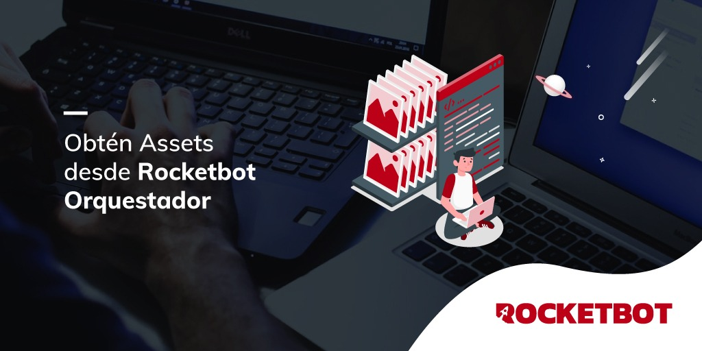

# Assets_NOC
  
Módulo para obtener asset de Rocketbot NOC  
  

## Como instalar este módulo
  
__Descarga__ e __instala__ el contenido en la carpeta 'modules' en la ruta de rocketbot.  

# Como usar este modulo

Debemos tener habilitado el uso del orquestador asi como el usuario, contraseña, URL del servidor.

## Descripción de los comandos

### Login NOC
  
Inicie sesión en NOC utilizando credenciales como nombre de usuario y contraseña, clave API y archivo noc.ini.
|Parámetros|Descripción|ejemplo|
| --- | --- | --- |
|URL Servidor|URL del servidor a donde se conecta|https://roc.myrb.io/|
|Nombre de usuario|Nombre de usuario|User1|
|Contraseña|Contraseña del usuario|Password|
|API Key|API Key para conectarse al servidor|224f1e15-aab7-4632-85ce-321938cb096b|
|Ruta Archivo .ini|Archivo .ini con las credenciales del usuario|C:/Users/User/Desktop/archivo.ini|

### Obtener Asset Específico
  
Obtiene el asset especifico que se le indique
|Parámetros|Descripción|ejemplo|
| --- | --- | --- |
|Nombre de Asset|Nombre del asset a obtener|Test|
|Token del proceso|Token del proceso|27FEXKIXFRFDUNVD|
|Guardar en Variable|Variable donde se guardara el resultado. Nombre de variable sin llaves {}|Variable|

### Obtener Todos los Assets
  
Obtiene todos los Assets y los asigna a las variables correspondientes
|Parámetros|Descripción|ejemplo|
| --- | --- | --- |
